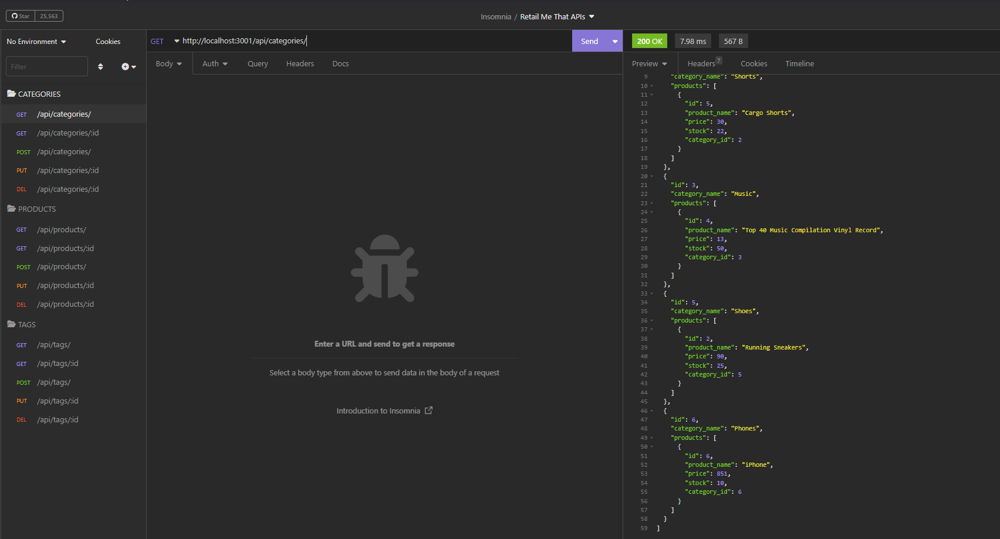

# Retail Me That


## Description

Retail Me That is an application that will handles all the work of the server so you just plug you website in and get down to business.

## Table of Contents

- [Installation](#installation)
- [Usage](#usage)
- [License](#license)
- [Tests](#tests)
- [How to Contribute](#how-to-contribute)

## Installation

If you would like to run this application, please run the following command(s) to install the necessary requirements:
```
npm i
```

## Usage

It is quite intuitive. Why not just give it a try?

Below is a demonstration of the application: 

[](https://drive.google.com/file/d/1l2qAjiqC164YPayDtmarIAOYjhmUzHuf/view?usp=share_link)

## License

This repo utilizes the MIT license. If you would like to know more information, you can check out its [license page](https://choosealicense.com/licenses/mit/) for its permissions, conditions and limitations.

## Tests

If you would like to run tests for this repo, please run the following command(s):
```
npm test
```

## How to Contribute

If you would like to contribute, feel free to reach out to me at [jdpauldo94@gmail.com](mailto:jdpauldo94@gmail.com).

If you like what you see here, please feel free to checkout my other work on my [Github page](https://github.com/JPauldo).
